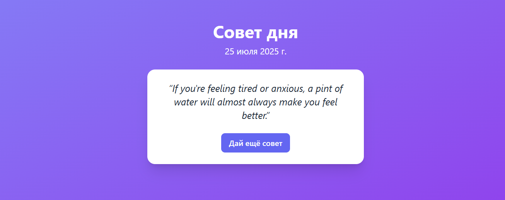

# advice-app
Одностраничное React-приложение, которое показывает случайные советы с сервера. При каждом нажатии на кнопку загружается новый совет. Стилизовано с помощью Tailwind CSS.

---

## Превью

---

## Функциональность

-  Отображение текущей даты
-  Получение случайного совета из API
-  Кнопка "Дай ещё совет"
-  Индикация загрузки
-  Градиентный адаптивный дизайн
-  Карточка с кавычками
-  Tailwind CSS

---

## Технологии
*  React
*  Vite
*  Tailwind CSS
*  REST API

## API

Используется открытое API:
> https://api.adviceslip.com/advice
